# NTN Worker Tools

Local web UI for the [Notion Workers](https://developers.notion.com/workers/get-started/overview) (`ntn`) CLI. Point it at any registered worker and get a graphical view of syncs, runs, and capabilities without leaving your browser.

Status: **Feature Complete.** Ready for external testing.

## Demo

[](https://www.youtube.com/watch?v=Ifbj0BLvW-s)

## Screenshots
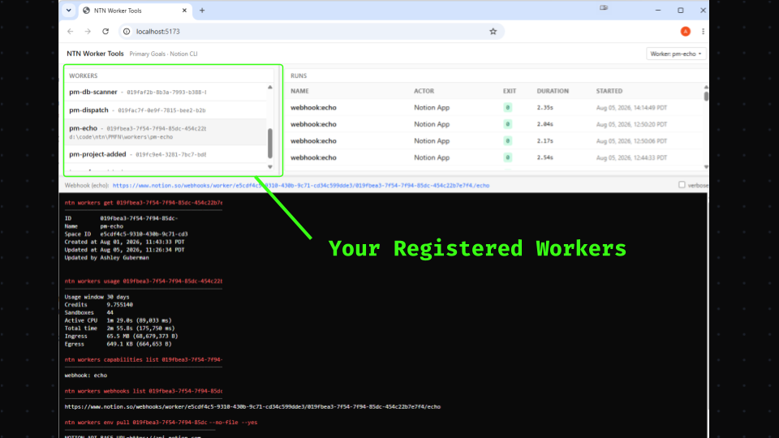
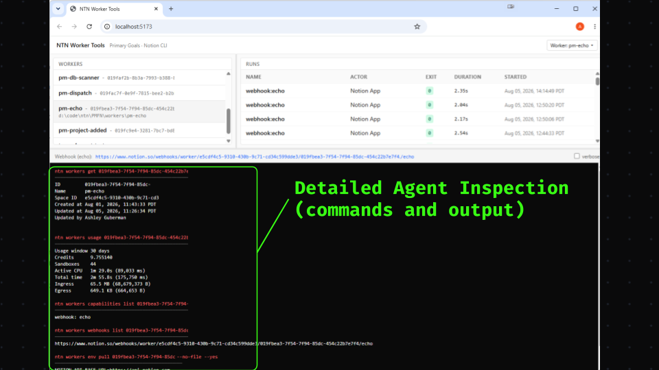
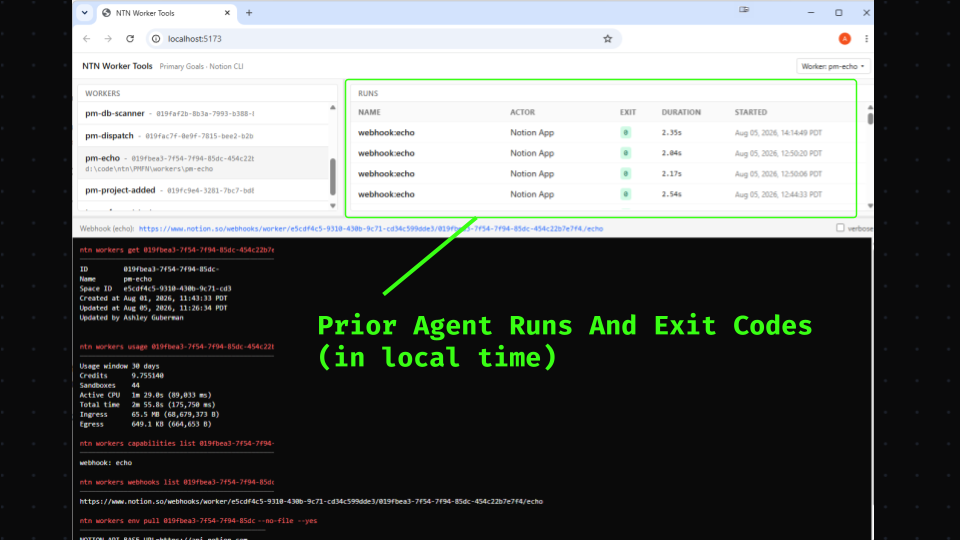
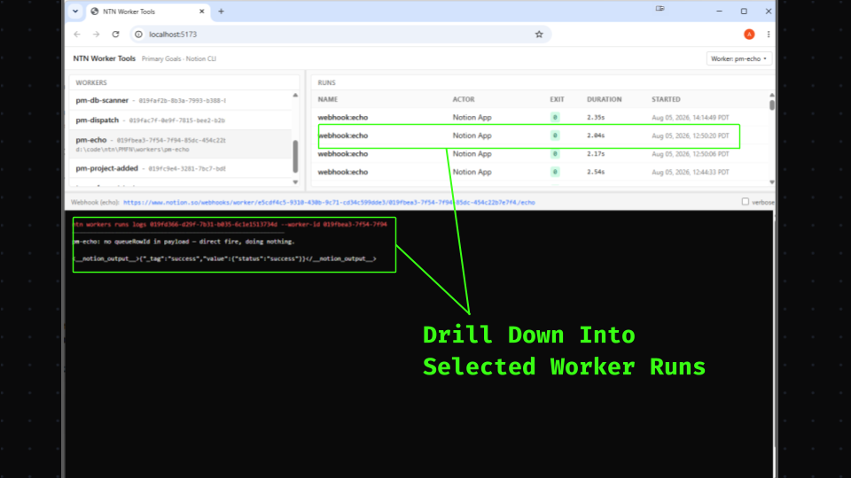
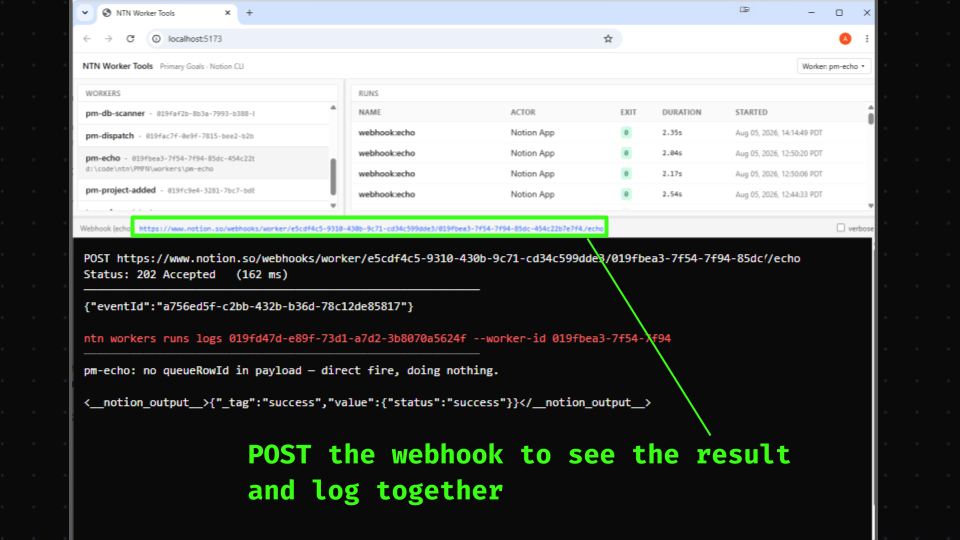
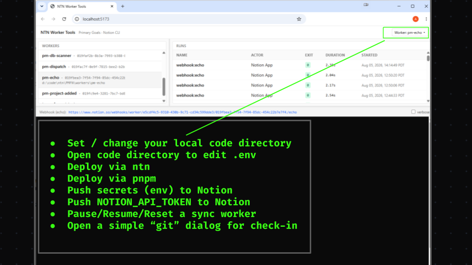


## Prerequisites

- Node.js >= 22
- pnpm >= 11 (repo pins `pnpm@11.18.0` via `packageManager`)
- The `ntn` CLI installed and on your `PATH` (`ntn --version` should work from a terminal)
- At least one Notion Workers on your Notion workspace

## First-time setup

### 1. Install Node.js

**Windows (winget, elevated PowerShell):**

```powershell
winget install OpenJS.NodeJS.LTS
```

If `winget` returns exit code `1603` with "A later version of Node.js is already installed", Node is already there — the installer just isn't on your current shell's `PATH`. Open a fresh PowerShell and check:

```powershell
node --version
```

If it still isn't found, add `C:\Program Files\nodejs` to your system `PATH` (elevated PowerShell):

```powershell
[Environment]::SetEnvironmentVariable("Path", [Environment]::GetEnvironmentVariable("Path","Machine") + ";C:\Program Files\nodejs", "Machine")
```

Then close and reopen PowerShell.

**macOS / Linux:** use your usual method (`brew install node`, nvm, fnm, distro package, etc.). Any Node >= 22 works.

### 2. Install pnpm

Node 25+ no longer bundles Corepack, so install pnpm directly with npm (which ships with Node):

```bash
npm install -g pnpm@11.18.0
```

Verify:

```bash
pnpm --version
```

Should print `11.18.0`.

> If you are on Node <= 24, you can alternatively use Corepack: `corepack enable; corepack prepare pnpm@11.18.0 --activate`. Corepack reads the pinned version from `packageManager` in `package.json` automatically.

### 3. Clone and install dependencies

```bash
git clone https://github.com/PrimaryGoals/ntn-worker-tools.git
cd ntn-worker-tools
pnpm install
```

## Run

```bash
pnpm dev
```

The web app runs at `http://localhost:5173`, the API server at `http://localhost:5174`.

If port 5174 is already in use, copy `apps/server/.env.example` to `apps/server/.env` and set `PORT` to something else. (Port 5173 is set in `apps/web/vite.config.ts` — if you change it there too, also set `WEB_URL` in `.env` so the printed sign-in link stays correct.)

## User Interface

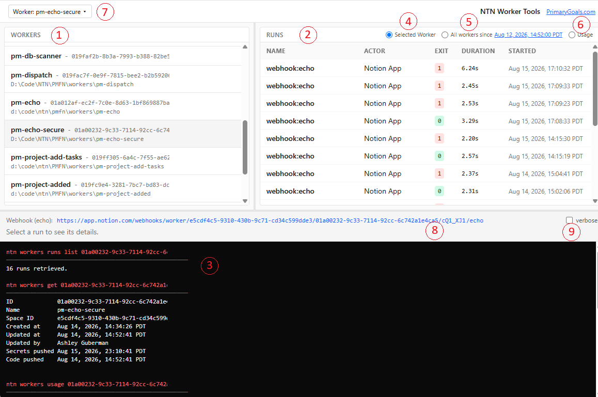

1. All workers already registered on your Notion workspace. Each worker's row shows:
   1. The worker's name (renameable)
   2. The worker's ID (used in other `ntn` commands)
   3. The local directory where its code lives, if one is registered
2. All executions (runs) of the selected worker. Times are shown in local time rather than UTC.
3. Any interaction with ntn-worker-tools displays the exact command that was fired and its results.
4. The default view — selecting a worker shows its runs.
5. A cross-worker view. It shows all runs from all workers up to a fixed point in time.

   <details>
   <summary>This aids in debugging when one worker calls another, or when one may be interacting with another</summary>

   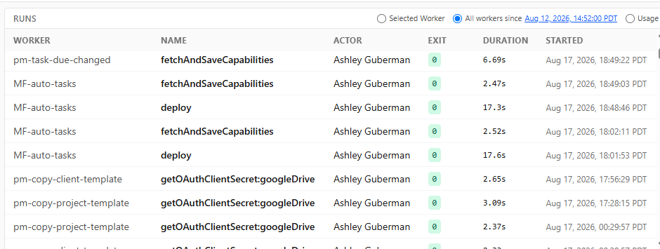

   </details>

6. An interactive view of credit usage that you can sort by column.

   <details>
   <summary>It adds the calculated credits per execution (C/E) so that you can see which workers are more expensive per-run.</summary>

   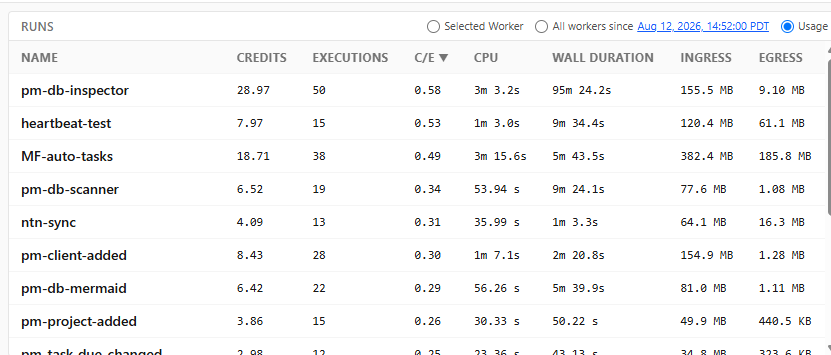

   </details>

7. Menu options — see [Menu Options](#menu-options) below.
8. The webhook URL. Clicking it fires a POST request:
   - If the worker requires a `WEBHOOK_SECRET`, it's added to the request header automatically.
   - The equivalent `curl` command is shown so you can reuse it in local scripts.
   - The log of the most recent execution is displayed automatically.
9. A verbose toggle that adds `-v` to the underlying `ntn` commands.

## Menu Options

All options are shown below, but some are only enabled when conditions are met, based on the worker selected.

<details>
<summary><strong>Set Local Folder</strong></summary>

<table>
<tr>
<td width="31%">

When you select a worker that's already deployed to your Notion workspace, you can choose the local folder containing its code. The association is stored in an application profile on disk. Once made, the other menu items that depend on a local folder become active.

</td>
<td>

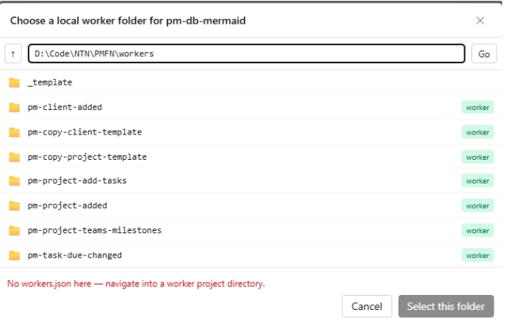

</td>
</tr>
</table>

</details>

<details>
<summary><strong>Reveal in Explorer</strong></summary>

<table>
<tr>
<td width="25%">

With any worker selected, you can reveal its code in your file explorer from the menu, or click its path shown next to the worker in the list.

</td>
<td width="75%">

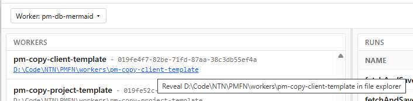

</td>
</tr>
</table>

</details>

<details>
<summary><strong>Rename Worker</strong></summary>

<table>
<tr>
<td width="19%">

Renaming a worker renames both the directory containing its code and its name on the server. Its ID and webhook URL do not change.

</td>
<td width="81%">

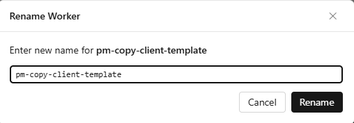

</td>
</tr>
</table>

</details>

<details>
<summary><strong>Deploy Workers</strong></summary>

<details>
<summary><code>ntn workers deploy</code></summary>

<table>
<tr>
<td width="20%">

For simple workers created with <code>ntn workers new</code>, this runs the corresponding <code>ntn</code> command to deploy them to Notion. Be patient — deployment can take 30 seconds or more, with no visible progress until it completes or errors.

</td>
<td width="25%">

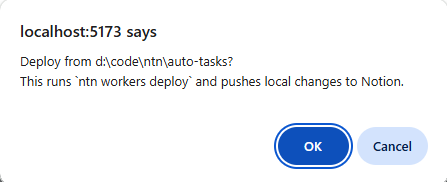

</td>
<td width="55%">

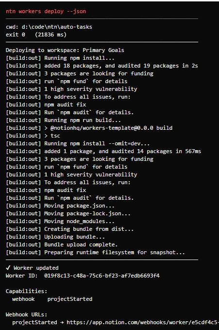

</td>
</tr>
</table>

</details>

<details>
<summary><code>pnpm run deploy</code></summary>

<table>
<tr>
<td width="19%">

Enabled when the project defines its own <code>scripts.deploy</code> in <code>package.json</code>. This is more typical when working with a series of workers in a monorepo that needs a custom local bundling step first.

</td>
<td width="81%">

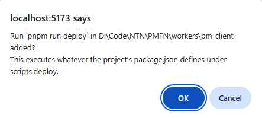

</td>
</tr>
</table>

</details>

<details>
<summary>Deploy updated workers</summary>

<table>
<tr>
<td width="25%">

ntn-worker-tools keeps track of the last time you deployed code or pushed secrets to Notion. That information is shown next to each worker, and **Deploy updated workers** lets you choose, per worker, whether to push secrets, code, or both.

**Note:** Pushing secrets to Notion also bumps the worker's server-side "updated" timestamp, so that date alone can be a misleading signal for undeployed code changes. That's why you can manually choose exactly which elements to deploy for each worker.

</td>
<td width="29%">

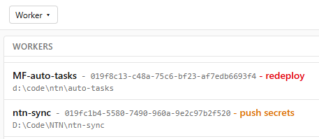

</td>
<td width="46%">

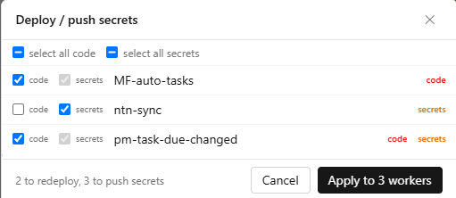

</td>
</tr>
</table>

</details>

<details>
<summary>Deploy to new workspace</summary>

<table>
<tr>
<td width="50%">

You'll only use this option when you develop your workers on one workspace and then deploy them on other workspaces. **ntn-worker-tools** handles the administrative plumbing to make this work.

The recommended pattern: develop using a VCS like git, commit your changes, and create a branch per workspace you deploy to — this is because redeploying to a new workspace overwrites <code>workers.json</code>, and possibly <code>package.json</code>.

Run <code>ntn logout</code> to leave your development workspace, then <code>ntn login</code> to connect to the new one. Your worker list will be empty the first time, but **Deploy to new workspace** will ask you to select the directory where your worker's code lives.

You'll have to delete the local <code>workers.json</code> before you can deploy to a new environment. While deleting <code>.env</code> isn't required, you'll have to edit it before deploying to the new workspace.

You may optionally change the name of the worker on the new workspace, which will also update <code>package.json</code>.

</td>
<td width="50%">

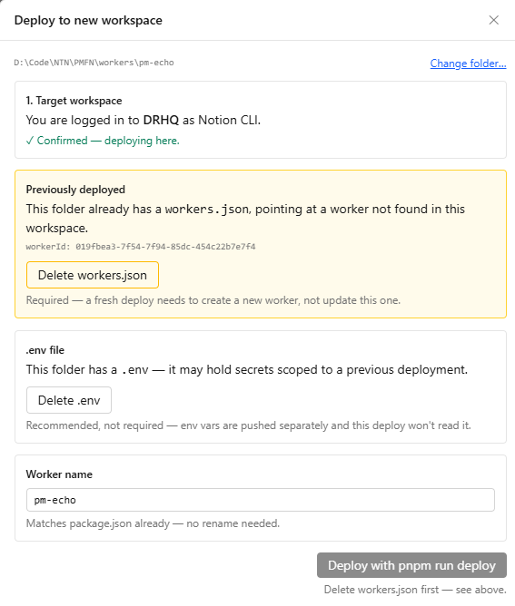

</td>
</tr>
</table>

</details>

</details>

<details>
<summary><strong>Secrets</strong></summary>

<details>
<summary>Push secrets to Notion</summary>

<table>
<tr>
<td width="56%">

This takes the contents of your local <code>.env</code> file and updates all variables for the worker on Notion. The two most common and important variables include:

- `NOTION_API_TOKEN` — created under Notion's developer tools.
- `WEBHOOK_SECRET` — for webhooks that require a security key to be passed in the header for authentication before launching. This prevents your worker from being triggered by unauthorized users or services, and can be rotated when needed.

</td>
<td width="44%">

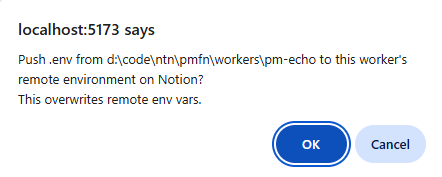

</td>
</tr>
</table>

</details>

<details>
<summary>Push NOTION_API_TOKEN</summary>

In cases where you did not deploy the worker yourself, or when the worker was created by a personal agent, you still need a way to push the <code>NOTION_API_TOKEN</code> to the worker.

This option is only active if you do not have a local folder for the worker, because if you did, you would use **Push secrets to Notion** instead.

</details>

</details>

<details>
<summary><strong>OAuth</strong></summary>

These menu items are only active when you select a worker that supports OAuth.

<details>
<summary>Show redirect url</summary>

For workers that have an OAuth service, this menu returns the redirect URL used to establish your credentials. OAuth support is visible via `ntn workers capabilities [workerId]`. The menu option executes `ntn workers oauth show-redirect-url`. The typical URL returned is `https://app.notion.com/workers/oauth/callback`.

</details>

<details>
<summary>Start (authorize)</summary>

If your worker has values in <code>.env</code> for <code>GOOGLE_CLIENT_ID</code> and <code>GOOGLE_CLIENT_SECRET</code>, this fires `ntn workers oauth start --worker-id [workerId] googleDrive`. That opens a web browser where you log in, which sends the authentication to the callback URL.

</details>

<details>
<summary>Token</summary>

This displays the token that was returned to the redirect URL when you authorized OAuth. You can use this for debugging.

</details>

</details>

<details>
<summary><strong>Time Markers</strong></summary>

The "marker" is a line made at a particular timestamp. Use it when you are about to start a test, and want to delineate all runs that occur after that point in time. The time marker is also used when looking at cross-worker runtimes.

<details>
<summary>Mark current time</summary>

Sets the marker at the current date and time.

</details>

<details>
<summary>Clear time marker</summary>

Removes the time marker.

</details>

<details>
<summary>Adjust time marker</summary>

Lets you place the marker at any arbitrary time.

</details>

</details>

## Layout

```
ntn-worker-tools/
├── apps/
│   ├── web/                Vite + React + TS + Tailwind
│   │   └── src/
│   │       ├── App.tsx             Top-level layout and routing between panels
│   │       ├── api.ts               Typed client for the server's /api/* endpoints
│   │       ├── format.ts            Pure formatters (bytes, durations, sync status, etc.)
│   │       ├── hooks/                One hook per concern: UI state, worker data (queries),
│   │       │                         deploy/sync mutations, webhook mutations, config mutations
│   │       └── components/
│   │           ├── ui/              Presentational primitives (Panel, MenuItem, ExitCodeBadge, ...)
│   │           ├── modals/          TokenPushModal, FolderPickerModal, RenameWorkerModal, ...
│   │           └── *.tsx            Feature components (MenuBar, WorkersList, RunsList, ...)
│   └── server/              Fastify server that shells out to ntn CLI
└── packages/
    └── shared/               Types shared between web and server
```

Start in `App.tsx` to see how a screen is assembled, then follow the hook/component names — each hook or component file is scoped to one concern, so the file name tells you what you'll find inside.

## Roadmap

MVP:

- [X] Sync status (live), preview, trigger, state reset
- [X] Runs list + logs viewer
- [X] Capabilities list + enable/disable

Later:

- [ ] Fetch code from deployed agents that you did not write yourself

## Advanced Automation

As a business owner, you want the trust and reliability of your existing tools, along with the ease of use and a central view of how everything fits together. The problem is that different systems don't talk to each other by default. You know it's possible, but it's too much work, or too complicated, to do on your own.

At [Primary Goals](https://PrimaryGoals.com/ntn/), we specialize in systems integration with Notion. Notion Workers are the perfect blend of powerful automation, deep integration with Notion, and cost-effectiveness — that's because Workers execute your business process deterministically, with code, rather than probabilistically, using AI or agents. You get all the benefits of AI at a fraction of the cost.

[](https://PrimaryGoals.com/ntn/)

<p>
  
  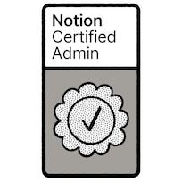
</p>

## License

Apache 2.0 with trademark clause. See [LICENSE](LICENSE) for details. Allows commercial use and derivatives with attribution required; Primary Goals branding is protected.
